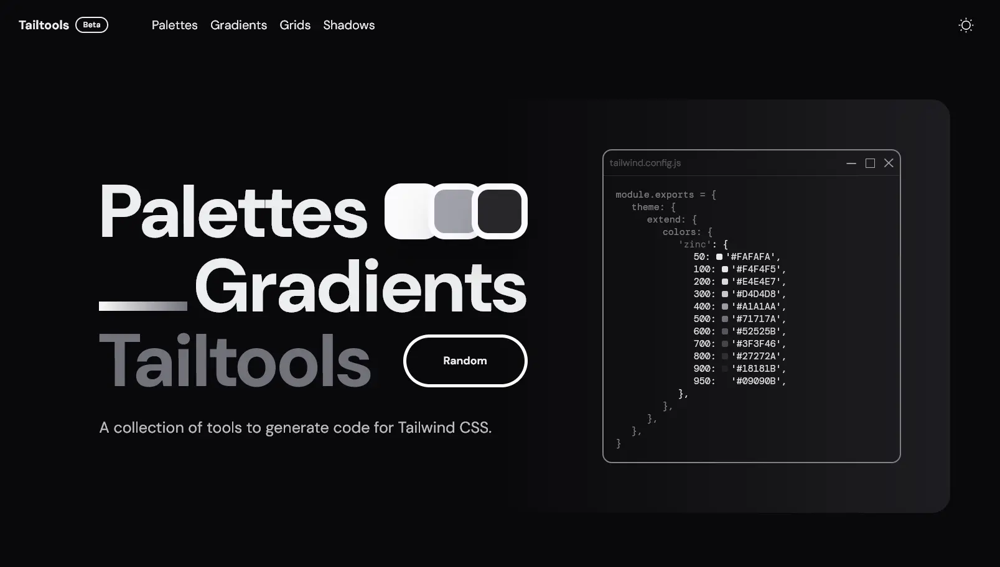

<h1>Tailtools</h1>

   

 

Design even faster with our collection of interactive tools to generate code for Tailwind CSS, generate color palettes, gradients for backgrounds or texts, grids for your layout, shadows for your components, and more.

 

 

## ✨ Features

-   **Color Palette Generator**: Generate a color palette with a single click.
-   **Gradient Generator**: Generate a gradient for backgrounds or texts.
-   **Grid Generator**: Generate a grid for your layout.
-   **Shadow Generator**: Generate a shadow for your components.
-   **And more**: We are constantly adding new tools to help you design faster.

## 🛠️ Stack

-   [React](https://reactjs.org/): web development.
-   [TypeScript](https://www.typescriptlang.org/): JavaScript with types.
-   [Tailwind CSS](https://tailwindcss.com/): Utility-first CSS framework for rapidly building custom designs.
-   [Next UI](https://nextui.org/): UI library for React.
